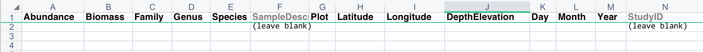

```{r setup, include=FALSE}
knitr::opts_chunk$set(echo = TRUE)
```


## Introduction

**[BioTIME](http://biotime.st-andrews.ac.uk)** is an open-access database for long-term assemblage data contributed from research groups globally. The power of our database is quite literally in the numbers. We currently have:

#### 443 studies
#### 12,964,172 records
#### 681,830 locations
#### 49,464 species

But in order for data to be useful and comparable in our database, we need to check and adapt datasets to a common standard and format as they come in from various researchers and institutions. This primarily falls to the task of data curation. This workshop will walk you through adapting a dataset into the common BioTIME dataset format.

## Objectives

Hopefully, by the end of this workshop, you'll be able to:  

* Learn how to validate and check large datasets using R  
* Use data wrangling to rectify any issues that come up in data checking  
* Aggregate and omit data records, join and manipulate data tables  
* Integrate version control using the RStudio Git interface  

## Definitions
Before we start, here are some terms we use to describe dataset/sampling design elements:

- **Record**: numerical abundance (or biomass, % cover) of species per observation event (i.e. per sample); might be necessary to pool abundance of different life stages, sizes or sex (same for biomass).
- **Observation event / Sample ID/ Unique sampling event**: unique combination of date & latitude & longitude or date & plot (& depth or elevation if applicable), when not defined otherwise.
- **Site**: smallest possible area that has been repeatedly sampled through time in the dataset.  
- **Plot**: a subsetted location within the site that may or may not be sampled through time consistently. Transects, trawls, or quadrats fall under this definition. Not all datasets will have information at the plot level and that's ok.
- **Grain size**: The area covered by each sampling event. If a dataset incorporates plots, the area of the plot would be the grain size. At the site level, we often need this provided through methods.  
*If a site contains plots that have all been sampled consistently through time (e.g. some plots were not left out/added in some years), we still call the aggregate of plots as a site.*

## Setup {.tabset .tabset-pills}

There are a few things to set up before we start curating. If you want to learn to implement version control with Git and GitHub in RStudio, get set up with these steps, but this is elective and the following instructions will work without versioning as well.

### GitHub + RStudio
First, *clone* the Github repository for this workshop. This way, we can have RStudio talk with GitHub and track how our R scripts are changing with each save. **Version control** is a really good practice so that we can track the changes implemented by different data curators.

If you've never used Git in RStudio before, you'll need to configure GitHub and RStudio to communicate with your account.

#### GitHub + RStudio configuration
1. In RStudio, go to *Tools > Global Options > Git/SVN*. Click *Create RSA key > Create*. Ignore the password fields. Close the dialog. Click *View public key* and copy the key in the textbox.
2. Sign in or create your [Github account](http://github.com/settings/key) and go to *Settings > SSH and GPG keys*. This tells GitHub it's you talking from RStudio when you want to push files to the repository in the cloud. Call it RStudio (or whatever you'd like) and save.
3. Replace the following lines with your GitHub login credentials. Go to RStudio, *Tools > Shell*, paste the code and press Enter. Close the dialog.
`git config --global user.email "youremail@st-andrews.ac.uk"`
`git config --global user.name "username"`

#### Clone a repo
4. And now we're ready to clone! Go to *File > New Project > Version Control*. In Repository URL, put `https://github.com/bioTIMEHub/DataCuration-workshop.git` and the directory you want the local repository copy to go.

This is now set up! Git controls are located in the Git tab next to *Help*. Whenever you save your R script (or make significant changes), **stage, commit, and push** your changes to the GitHub repository. 

**Staging** tells your computer's Git software to detect the code lines that changed. **Committing** tells Git to log the current state, while **pushing** communicates with GitHub's cloud to save your commits to the cloud. This way, your collaborators can then see and maybe build on your progress. Regular commits and pushes keeps a good record of your changes and you can revert if anything goes wrong (similar to Google Drive).

### R Script
let's load our necessary packages and import the dataset we'll be working on. Depending on your coding style and preferences, we'll be showing examples with both base R and `tidyverse` functions, but some tasks like taxonomy fixes will rely more heavily on packages. If you don't have these packages, run `install.packages(c('tidyverse', 'readxl', 'maps'))` in your console.

**Download this dataset is on arachnids/spiders from the Hoge Kempen National Park located in Belgium: [click here](https://universityofstandrews907-my.sharepoint.com/:x:/g/personal/fycc1_st-andrews_ac_uk/ETyEHl_jDy5OuNMwIczd60MBF445_UP5_p5NBG2ERNrxMA?e=ojuIPt)**

```{r Setup, results='hide', message=F}
# load the required packages
require(tidyverse)
require(readxl)
require(maps)

# import our data from the Excel spreadsheet
dt <- read_excel('S007.xlsx', sheet=1, skip=3, col_names=T, na='')
# skip = 3 is to avoid unnecessary metadata at the top which we don't want to read

View(dt) # always do a visual check :)
```

## Dataset criteria

When we get a contributed dataset, we first check whether they fit our criteria. Often, this can be done by scanning the relevant methods provided in the dataset metadata. Previously, good datasets have come from data integration sources such as OBIS, GBIF, Ecological Archives and data papers from reputable journals.

1. Dataset consists of at least 2 years of sampling (they do not have to be consecutive).
2. Dataset consists of entire assemblages, not just populations (*sensu lato*, i.e. does not exclude some taxa intentionally).
3. Data should record abundance, biomass or both.
4. Sampling methods *and effort* are consistent through time.
5. Individuals are identified to species level where possible.

Here are the detailed methods provided to use by the dataset author. Do you think they fit our criteria?

> Pitfall traps were installed in different UTM plots in the NPHK (50 km^2^), which consists different habitats (see description habitats). Traps were left on location for approximately one month, then emptied and refilled. Per location spring - summer, but not every location yearly (see dataset). In different UTM grids, different habitats were sampled several times over the period of 30 years (1986 - 2017)
This dataset includes only heathland from the UTM FS8546 grid for temporal regularity (see Pilotto et al. https://doi.org/10.1038/s41467-020-17171)

Let's use R to help us check the first criteria:

```{r Duration criteria}
# are there 2 or more unique years in the dataset?
n_distinct(dt$year) >= 2
# n_distinct is identical to length(unique(x)) in base R, which counts the unique values
```

## Target format

Also, before we move forward, have a look at the data template/format we want this dataset to reflect. Familiarising yourself with this will be helpful to know what fields need to be transformed, added, or omitted to fit this. Even if the dataset does not have all the data to fill these fields, they need to be put in as blank columns. * *StudyID is left as a blank column to be automatically filled in when we add this to the database server. Don't worry about it.*

**Table 1**: BioTIME raw data template format.



## Overall checks {.tabset .tabset-pills}

And like most work dealing with datasets, it's good to look at the basic structure before we do anything. I'll show you how we check this, but try and think about how you might fix these issues before clicking onto the fix tab.

### Check
```{r Structure check}
dim(dt) # check dimensions, returns row and column counts
summary(dt)
```

To make sure fields behave properly if we manipulate them, they have to be of the right data type:
**Abundance or biomass**: numeric
**Coordinates**: numeric
**Dates**: POSIXct or 
**Year, month, day* columns,**: integers or factors
**Plot**: factors or integers
**DepthElevation**: numeric or factors (if they're a treatment category)
**Taxonomic**: characters or factors

```{r Field check}
# Abundance and/or biomass, latitude and longitude numeric?
# Deal with coordinates later
is.numeric(dt$Abundance)

# Year, month and day must be integers or factors
# | means or
is.factor(dt$year) | is.integer(dt$year)

# Secondary fields such as trawl, plot, transect etc must be factors or integers? NA
# Secondary fields such as elevation or depth will normally be numeric unless in a treatment format. NA here
# Date should be POSIXct (not applicable in this case) NA, just year

# Taxonomic fields must be characters or factors?
is.factor(dt$Family) | is.integer(dt$Family)
is.factor(dt$Taxon) | is.integer(dt$Taxon)
```

### Fixes

Three checks didn't pass: year, family, and taxon.

```{r Field fixes, results = 'hide'}
# The year column here is numeric so convert it to factor
dt$year <- as.factor(dt$year)
# and characters for the taxonomic fields
dt$Family <- as.character(dt$Family)
dt$Taxon <- as.character(dt$Taxon)
```

This is also a good time to remove any extraneous columns that BioTIME doesn't use. I'm also going to rename these before we move ahead.

``` {r Omit columns, results = 'hide'}
# if there is only one site throughout the dataset, we can get rid of it
dt$Site <- if(length(unique(dt$Site)) == 1){NULL}
# habitat and group aren't needed
dt$Habitat <- NULL
dt$Group <- NULL

# Renaming year column to match ours
colnames(dt)[1] <- 'Year'
```

## Primary fields {.tabset .tabset-pills}

To check primary fields (abundance, coordinates, and dates), we just need to make sure that:
- Fields don't contain blanks, zeroes, negative values, NAs, or NaNs
- Fields are logical, real values, i.e. within possible limits
- We need to pool abundances for different sexes or life-forms (adults&juveniles). An exception to this are amphibia (anurans in particular) because the methodology to sample adults & tadpoles can be very different. If the authors submit the data separately, we keep it this way.

``` {r Primary field check}
# Abundance
min(dt$Abundance) > 0 # no zeroes?
sum(dt$Abundance=="") > 0 # no blanks

# Year < 2021, month < 12, day < 31
summary(dt[,1])

# if there are rows that need to be removed
# dt <- dt[!is.na(dt$Abundance),]
# dt <- dt[!which(dt$Abundance == 0),]
# or with dplyr's filter() function, which can handle multiple conditions
# dt <- dt %>% filter(!Abundance == '' | Abundance == 0 | is.na(Abundance))
```

This dataset does not separate abundances by sex or ontogeny, but if we needed to pool abundances, `dplyr` would be good for this. For example, assuming if there was a column in `dt` called `Juvenile`, we'd group the dataframe by everything except for Abundance and Juvenile, so they get ignored in the `summarise()` function.

``` {r Pool abundances, eval = F}
dt %>% group_by(Year, Family, Taxon) %>% 
  summarise(Abundance=sum(Abundance)) %>% ungroup()
```

For coordinates in latitude and longitude, we work primarily in WGS84, so latitude has to be constrained between -90 to 90, and longitude from 0 to 180. Our dataset contributor only provided coordinates `50.931, 5.626`for the entire site, so we'll just manually put them in.

``` {r Coords, results='hide', error=F}
dt$Latitude <- as.numeric(rep('50.931', nrow(dt)))
dt$Longitude <- as.numeric(rep('5.626', nrow(dt)))
```

We'll also plot this to visually confirm that the coordinates are as expected. Often times people might switch longitude with latitude and still be logical, real coordinates to our code.

### Plot
``` {r Coord plot, echo = FALSE, message=F, warning = F, error= F}
world_map <- map_data('world') # check whether the GPS coordinates match expectations
world <- ggplot(world_map) + 
  geom_polygon(aes(x=long, y=lat, group=group), color='grey', fill='transparent') +
  coord_fixed() + 
  labs(x='Longitude', y='Latitude') +
  theme_bw() + theme(panel.grid=element_blank())
points <- world + geom_point(data=dt[1,], aes(x=Longitude, y=Latitude), shape=21)

points + coord_fixed(xlim=c(0,10), ylim=c(40,60))
detach('package:maps')
```

### Code
``` {r Coord plot code, echo = T, eval = F, results = 'hide'}
world_map <- map_data('world') # check whether the GPS coordinates match expectations
world <- ggplot(world_map) + 
  geom_polygon(aes(x=long, y=lat, group=group), color='grey', fill='transparent') +
  coord_fixed() + 
  labs(x='Longitude', y='Latitude') +
  theme_bw() + theme(panel.grid=element_blank())
points <- world + geom_point(data=dt[1,], aes(x=Longitude, y=Latitude), shape=21)

points + coord_fixed(xlim=c(0,10), ylim=c(40,60))
detach('package:maps')
```

## Secondary fields

Sometimes data will have trawl, plot, depth, bottom depth or similar secondary fields. They must be inspected but we don't always want to remove records that have errors in these fields. It will depend on the type of error.**The premise when tidying these fields is that values make sense and are in accordance with the source methods description.** It'll often vary on a case by case basis and require executive judgement by the curator.

**Criteria:**

- If the error (e.g. a NULL) makes it impossible to assign the value to a group, then remove it.
- If the error is a misspelling or a missing value that can be clearly re-assigned by reading the methods, then do not remove the record and fix it in the appropriate way.

```{r, eval=F, message=FALSE, results=TRUE, warning=FALSE}

# Plot and treatment must be inspected for NA, NULL, blank or values unspecified in source methods
# We must check for misspellings and revalue levels if needed

# For this, we can use:
sort(unique(dt$plot))
# and rename levels using:
levels(dt$plot) <- plyr::revalue(levels(dt$plot),
                                 c("old_name"="new_name",
                                   "old_name1"="new_name1"))

# Repeat processes used for primary fields.
# DepthElevation can be 0, but not NaN, NA, NULL or blank only in some records.

```

## Taxonomic fields

Now, we check the taxonomic fields. From experience, this is where the bulk of data curation efforts go toward because taxonomy/species IDs are messy and data aren't perfect. `stringr` is a great package to use for automating detecting patterns in text strings. It comes in handy for replacements too. I refer [to this cheatsheet](http://edrub.in/CheatSheets/cheatSheetStringr.pdf) a lot. But for visual checking of typos, this is largely by eye.

### Cleaning and checking objectives

- Eliminate blanks, NAs (but uncertain IDs up to family level are allowed), and zeroes.
- Fit uncertain IDs to our syntax or eliminate abbreviations that dataset contributors used.
- Fit proper taxa level with the correct fields (`Family, Genus, Species`)
- Remove non-organismal records (e.g. rock, sand) and incidental taxa records.
- Check that genus column doesn't have family names (end in *-eae* or *-idae*) or species column has genus names.
- Re-allocate taxonomic classifications into the appropriate column.
- Check for duplication and misspellings in the species names  (e.g. *Puffnius sp, Puffinus sp*; unidentified/unknown; *Buenia jeffreysi / Buenia jeffreysii*; double spacing; several spaces, authors name & date, etc.). We're not validating or updating species, but we do quick searches in Google Scholar to figure out which spelling is correct.
- Subspecies and annotated species names should be disregarded (e.g. *Amphiura (acrocnida) brachiate* should be considered as *Acrocnida brachiate*)
- If a record only has data until the genus level, it must have "sp" in species column.

### Nomenclature

**Uncertain or unidentified IDs**: "Genus sp" (without the full stop/period). If the dataset distinguishes between different uncertain IDs, we reformat them while making sure they're recognised as separate species: like "Genus sp1" and "Genus sp2"  
**No subspecies or varieties**: Lowest level = "Genus species"  
**Species groups**: Some taxa are less resolved and are placed into species complexes, e.g. *Dascyllus trimaculatus agg.* or *Rubus fruticosus agg.*. We denote this with "agg." to make sure it's not confused with other specific epithets. Uncertain IDs with several potential options do not count.  

*Reminder*: For `Species`, we only leave in species epithets! Don't put it into the usual *Genus species* convention.

``` {r Taxa check, }
dt$Species <- dt$Taxon # always work from a copy
# check that genera are genera, not family names (-idae/eae)
dt %>% filter(str_detect(Species, 'idae$|eae$'))
# check the species list for misspellings or non-BioTIME taxonomic convention names
# Do visual checks before splitting taxa up into the three columns.
sort(unique(dt$Species)) %>% word(., start=2, end=-1)
# this keeps IDs adjacent to their same-genus misspellings, but only looking at the last few words to check

sort(unique(word(dt$Species, 1))) # check genera
sort(unique(dt$Family)) # check family
```

```{r Taxa fix}
replace_g <- c( # make a replacement vector, pattern = replacement
  'Drassylus' = 'Drassyllus',
  'Hyposinga' = 'Hypsosinga',
  'Palludiphantes' = 'Palliduphantes',
  'Porhomma' = 'Porrhomma',
  'Tenuiphanthes' = 'Tenuiphantes'
  )

dt$Genus <- word(dt$Taxon, 1) # separate genus to its own column
dt$Species <- word(dt$Species, start=2) # species to its own column. Only the second word to ignore subspecies

# dt$Species <- str_replace_all(dt$Species, 'sp.$', 'sp$')
dt$Genus <- str_replace_all(dt$Genus, replace_g) # use the replacement vector to replace typos
# dt %>% distinct(Taxon, Genus, Species) %>% View()
# check visually, but do this in your console.

dt$Taxon <- NULL # get rid of it now that we've split and fixed
```

## Prepare for export

Now that everything has been checked and fixed, we can prepare the dataframe to look more like our target format and export! As a reminder, this is what we want:


          

We have to create a lot of blank columns, aggregate abundances according to site, plot, latitude, longitude, and date. This way we have one data record per species per sampling event. `SampleDescription` will also reflect this unique sampling event in a string.

``` {r Final formatting}
dt$Biomass <- rep('', nrow(dt))
dt$Plot <- rep('', nrow(dt))
dt$DepthElevation <- rep('', nrow(dt))
dt$Day <- rep('', nrow(dt))
dt$Month <- rep('', nrow(dt))
dt$StudyID <- rep('', nrow(dt))

# aggregate abundance records that are same species, plot, and survey day.
dt_merged <- dt %>% group_by(Biomass, Family, Genus, Species, Plot, Latitude, Longitude, DepthElevation, Day, Month, Year, StudyID) %>% 
  summarise(Abundance=sum(Abundance)) %>% ungroup() %>% arrange(Year, Family, Genus, Species)

dim(dt)[1]-dim(dt_merged)[1] # any change in aggregating?

# save the dataset name as an object so we save some typing
dataset_name <- 'LTER_HogeKempenNationalPark_Arachnids'
# put in as many non-blank fields unique to the sampling event
# If plot, depthelevation, month, and day are available, I'd add those in too
dt_merged$SampleDescription <- as.factor(with(dt_merged, paste(dataset_name, Latitude, Longitude, Year, sep='_')))
length(levels(dt_merged$SampleDescription)) # how many sampling events?
```

Now we'll reorder the columns to the proper format:

``` {r Reorder}
dt_merged <- dt_merged[c('Abundance',
                         'Biomass',
                         'Family',
                         'Genus',
                         'Species',
                         'SampleDescription',
                         'Plot',
                         'Latitude',
                         'Longitude',
                         'DepthElevation',
                         'Day',
                         'Month',
                         'Year',
                         'StudyID')] %>% arrange(Year, Family, Genus, Species)
head(dt_merged) # final check!
```

## Export and spreadsheet prep

The raw data is ready to be exported!

```{r Export, eval = F}
setwd(file.choose() %>% dirname()) # choose a file in the directory you want this saved in
write.csv(dt_merged, paste0(getwd(), dataset_name, '_rawdata_CC.csv'), row.names=F, na='') # replace your initials here
```

And now we switch over to Excel. Our database has several data tables for each dataset and they're all linked and cross-referenced by the StudyID. The raw data you just prepared is one data table, but we now have to fill in other data tables on metaData.


